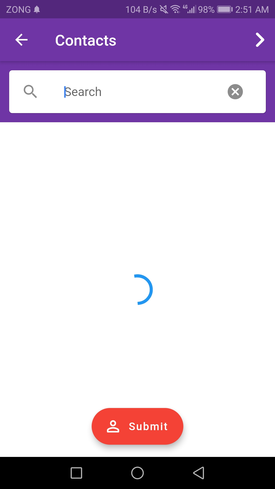

# Notification Flutter App Using Firebase
> Very useful in Class, Quiz or Assignment reminder.

## Features:

* One App have manage 3 type of Users
* user can only see the Notifications.
* Manager can send Notification From App and Also send Massages from App
* Admin Can Manage All Users from App and Make them Manage or vice versa
* Extended Floating Action Button
* User Login Save ( User cannot login Again & Again )
* Atractive UI.
* User Verify with Email on Registration Time.

## User app:

## Manager app:

## Admin app:

## Other Screenshots
<kbd></kbd>
<kbd></kbd>
<kbd></kbd>
<kbd></kbd>
<kbd></kbd>
<kbd></kbd>
<kbd></kbd>
<kbd></kbd>

## Cloud Firestore Structure
<kbd></kbd>

 For Upcoming Apps, Follow me 
[`umairnawaz333`](https://github.com/umairnawaz333) 
